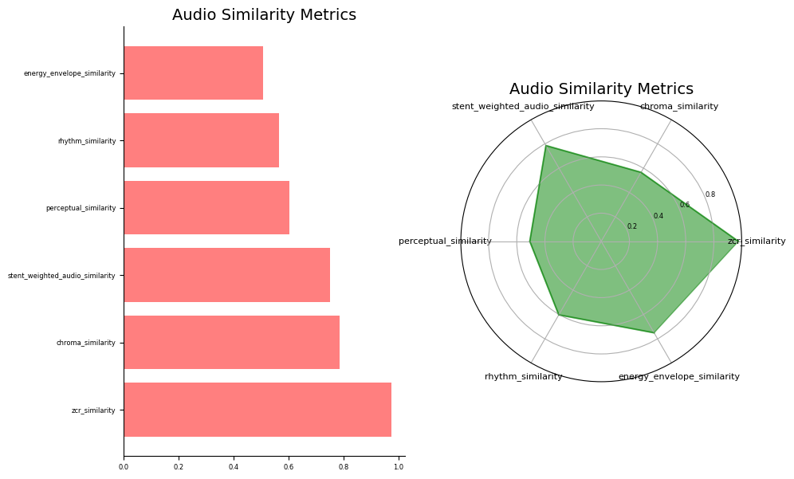

# Audio Similarity Package

## Table of Contents

- [Audio Similarity Package](#audio-similarity-package)
  - [Key Features](#key-features)
  - [Installation](#installation)
  - [Usage Example](#usage-example)
  - [Metrics](#metrics)
    - [Stent Weighted Audio Similarity](#stent-weighted-audio-similarity)
    - [Zero Crossing Rate (ZCR) Similarity](#zero-crossing-rate-zcr-similarity)
    - [Rhythm Similarity](#rhythm-similarity)
    - [Chroma Similarity](#chroma-similarity)
    - [Energy Envelope Similarity](#energy-envelope-similarity)
    - [Spectral Contrast Similarity](#spectral-contrast-similarity)
    - [Perceptual Similarity](#perceptual-similarity)
  - [Plotting](#plotting)
  - [License](#license)
  - [Contributing](#contributing)
  - [Acknowledgements](#acknowledgements)
  - [Contact](#contact)
  - [Bugs and future work](#Bugs-and-future-work)


The Audio Similarity Package is a Python library that provides functionalities to measure and compare the similarity between audio signals. It offers various metrics to evaluate different aspects of audio similarity, allowing users to assess the resemblance between original audio and generated audio, or between different audio samples.

Whether you are working on audio analysis, music generation, speech recognition, or any application that requires audio comparison, this package can be a valuable tool in quantifying and understanding the degree of similarity between audio signals.

## Key Features

-   Calculation of various audio similarity metrics:
    -   Zero Crossing Rate (ZCR) Similarity
    -   Rhythm Similarity
    -   Chroma Similarity
    -   Energy Envelope Similarity
    -   Spectral Contrast Similarity
    -   Perceptual Similarity
    -   Stent Weighted Audio Similarity
-   Customizable weights for the Stent Weighted Audio Similarity metric
-   Visualization of audio similarity metrics through spider plots and horizontal bar plots
-   Easy-to-use interface for loading and comparing audio files
 
## Installation

You can install the Audio Similarity package using pip. Open your terminal or command prompt and run the following command:

```bash
pip install audio-similarity
```

This will download and install the latest version of the package from the Python Package Index (PyPI) along with its dependencies.

Alternatively, you can install a specific version of the package by specifying the version number. For example, to install version 1.0.0, you can use the following command:

```bash
pip install audio-similarity==1.0.0
```

Once the installation is complete, you can import the package in your Python code and start using it:

```python
from audio_similarity import AudioSimilarity

# Rest of your code...
```

Make sure you have Python and pip installed on your system before running the installation command.

That's it! You have successfully installed the Audio Similarity package using pip. You are now ready to use it for audio similarity analysis.

## Usage Example

Here's a simple example to demonstrate how to calculate the Stent Weighted Audio Similarity using the Audio Similarity Package:

```python
from audio_similarity import AudioSimilarity

# Paths to the original and compariosn audio files/folders

original_path = 'path/to/audio_folder'
compare_path = 'path/to/compare_audio.wav'

# Set the sample rate and weights for the metrics

sample_rate = 44100
weights = {
    'zcr_similarity': 0.2,
    'rhythm_similarity': 0.2,
    'chroma_similarity': 0.2,
    'energy_envelope_similarity': 0.1,
    'spectral_contrast_similarity': 0.1,
    'perceptual_similarity': 0.2
}

sample_size = 20 # If you have a large number of audio files, its much faster to select a randome sample from each

verbose = True # Show logs

# Create an instance of the AudioSimilarity class

audio_similarity = AudioSimilarity(original_path, compare_path, sample_rate, weights, verbose=verbose, sample_size=sample_size)

# Calculate a single metric

zcr_similarity = audio_similarity.zcr_similarity()

# Calculate the Stent Weighted Audio Similarity

similarity_score = audio_similarity.stent_weighted_audio_similarity(metrics='all') # You can select all metrics or just the 'swass' metric

print(f"Stent Weighted Audio Similarity: {similarity_score}")
```

This example demonstrates the calculation of the Stent Weighted Audio Similarity (SWASS) using a set of predefined weights for each metric. You can customize the weights to reflect your specific requirements and preferences.

## Metrics

The following metrics are available in the Audio Similarity package:

### Stent Weighted Audio Similarity

The stent weighted audio similarity is a powerful composite metric that combines multiple individual metrics using user-defined weights. It offers a flexible approach to customize the importance of each metric based on specific requirements, allowing users to tailor the similarity calculation to their specific needs.

The stent weighted audio similarity metric enables you to consider different aspects of audio similarity simultaneously and assign relative weights to each aspect based on their importance. This approach acknowledges that different metrics capture distinct characteristics of audio signals and allows you to emphasize certain aspects over others when calculating the overall similarity score.

Here's how the stent weighted audio similarity is calculated:

1. Individual Metric Calculation: Each individual metric, including ZCR similarity, rhythm similarity, chroma similarity, energy envelope similarity, spectral contrast similarity, and perceptual similarity, is calculated between the original audio and the generated audio. These metrics capture different aspects of the audio signals, such as temporal patterns, pitch content, energy variations, spectral characteristics, and perceptual quality.

2. Weight Assignment: User-defined weights are assigned to each metric. These weights determine the relative importance of each metric in the overall similarity score. The weights should be non-negative and sum up to 1. Adjusting the weights allows you to prioritize certain metrics according to your specific application or preference. For example, if preserving rhythm accuracy is crucial, you can assign a higher weight to the rhythm similarity metric.

3. Weighted Score Calculation: The individual metric scores are multiplied by their respective weights. This step scales each metric's contribution to the overall similarity score based on the assigned weight.

4. Overall Similarity Calculation: The weighted scores from all metrics are summed to obtain the stent weighted audio similarity score. The resulting score represents the overall similarity between the original audio and the generated audio, considering the weighted contributions of each metric.

The stent weighted audio similarity score ranges from 0 to 1, with a value of 1 indicating maximum similarity. By adjusting the weights assigned to each metric, you can effectively control the influence of different aspects of audio similarity on the final score.

To use the stent weighted audio similarity metric, follow these steps:

1. Instantiate an instance of the `AudioSimilarity` class, providing the necessary parameters such as the paths to the original and generated audio files, the sample rate, and optional weights.

2. Set the desired weights for each metric using the `weights` parameter. If weights are not provided, default weights are used, evenly distributed among the metrics.

3. Call the `stent_weighted_audio_similarity` method to calculate the overall similarity score. This method internally calculates the individual metrics and combines them according to the assigned weights.

Here's an example usage of the stent weighted audio similarity metric:

```python
from audio_similarity import AudioSimilarity

original_path = '/path/to/folder/or/file'
generated_path = '/path/to/folder/or/file'

# Instantiate the AudioSimilarity class
audio_similarity = AudioSimilarity(original_path, generated_path, sample_rate, weights)

# Calculate the stent weighted audio similarity
similarity_score = audio_similarity.stent_weighted_audio_similarity()

print(f"Stent Weighted Audio Similarity: {similarity_score}")
```

The stent weighted audio similarity metric provides a comprehensive measure of similarity that can be customized to specific applications or preferences. By adjusting the weights assigned to each metric, you can prioritize different aspects of audio similarity, enabling more fine-grained analysis and evaluation of audio generation or transformation tasks.

### Zero Crossing Rate (ZCR) Similarity

Zero Crossing Rate (ZCR) Similarity is a metric that quantifies the similarity between the zero crossing rates of the original audio and the generated audio signals. The zero crossing rate is the rate at which the audio waveform crosses the horizontal axis (zero amplitude) and changes its polarity (from positive to negative or vice versa). The ZCR can provide insights into the temporal characteristics and overall shape of the audio signal.

The ZCR similarity ranges from 0 to 1, where a value of 1 indicates a perfect match between the zero crossing rates of the two audio signals. A higher ZCR similarity score suggests that the original and generated audio signals have similar patterns of changes in amplitude and share comparable temporal characteristics.

    zcr_similarity = audio_similarity.zcr_similarity()

### Rhythm Similarity

Rhythm Similarity is a metric that evaluates the similarity between the rhythmic patterns of the original audio and the generated audio signals. It focuses on the presence and timing of onsets, which are abrupt changes or transients in the audio waveform that often correspond to beats or rhythmic events.

The rhythm similarity score ranges from 0 to 1, with a value of 1 indicating a perfect match between the rhythmic patterns of the two audio signals. A higher rhythm similarity score suggests that the original and generated audio exhibit similar rhythmic structures, including the timing and occurrence of onsets.

While rhythm similarity provides valuable insights into the rhythmic patterns of audio signals, it should be complemented with other metrics and contextual information for a comprehensive assessment of audio similarity. Additionally, variations in rhythmic interpretation or different musical genres may influence the perception of rhythm similarity, requiring domain-specific considerations.

    rhythm_similarity = audio_similarity.rhythm_similarity()

### Chroma Similarity

Chroma Similarity is a metric that quantifies the similarity between the pitch content of the original audio and the generated audio. It focuses on the distribution of pitches and their relationships within an octave, disregarding the octave's absolute frequency. The chroma representation is a 12-dimensional feature vector that captures the presence or absence of each pitch class (e.g., C, C#, D, D#, etc.) in the audio signal.

The chroma similarity score ranges from 0 to 1, with a value of 1 indicating a perfect match in terms of pitch content. A higher chroma similarity score suggests that the original and generated audio exhibit similar pitch distributions, reflecting similarities in tonality, chord progressions, or melodic patterns.

It's important to note that chroma similarity focuses solely on pitch content and does not consider other aspects of audio, such as timbre or rhythm. Therefore, it is recommended to combine chroma similarity with other metrics and contextual information for a more comprehensive evaluation of audio similarity, especially in cases where timbral or rhythmic differences may influence the overall perception of similarity.

    chroma_similarity= audio_similarity.chroma_similarity()

### Energy Envelope Similarity

The energy envelope similarity is a metric that quantifies the similarity between the energy envelopes of the original audio and the generated audio. The energy envelope represents the magnitude variations of the audio signal over time, capturing the overall energy profile of the audio.

The energy envelope similarity score ranges from 0 to 1, with a value of 1 indicating a perfect match in terms of energy envelope. A higher energy envelope similarity score suggests that the original and generated audio exhibit similar energy variations over time, indicating similarities in dynamics, intensity, or loudness.

It's important to note that energy envelope similarity primarily focuses on the overall energy variations and does not capture detailed spectral or temporal features of the audio signal. Therefore, it is recommended to combine energy envelope similarity with other metrics and perceptual evaluations to obtain a more comprehensive understanding of audio similarity, especially in cases where timbral or temporal differences may impact the perceived similarity.

    energy_envelope_similarity = audio_similarity.energy_envelope_similarity()

### Spectral Contrast Similarity

  The spectral contrast similarity is a metric that quantifies the similarity between the spectral contrast features of the original audio and the generated audio. Spectral contrast measures the difference in magnitude between peaks and valleys in the audio spectrum, providing information about the spectral richness and emphasis of different frequency regions.

The spectral contrast similarity score ranges from 0 to 1, with a value of 1 indicating a perfect match in terms of spectral contrast. A higher spectral contrast similarity score suggests that the original and generated audio exhibit similar patterns of spectral emphasis and richness, indicating similarities in the distribution of energy across different frequency bands.

It's important to note that spectral contrast similarity primarily focuses on the spectral richness and emphasis patterns and may not capture other aspects of audio similarity, such as temporal dynamics or pitch content. Therefore, it is recommended to combine spectral contrast similarity with other metrics and perceptual evaluations to obtain a more comprehensive understanding of audio similarity, especially in cases where temporal or melodic differences may impact the perceived similarity.

    spectral_contrast_similarity = audio_similarity.spectral_contrast_similarity()

### Perceptual Similarity

The perceptual similarity metric quantifies the perceptual similarity between the original audio and the generated audio. It leverages the Short-Time Objective Intelligibility (STOI) algorithm, which is designed to estimate the perceptual quality and intelligibility of speech signals.

The perceptual similarity score ranges from 0 to 1, with a value of 1 indicating perfect perceptual similarity. A higher perceptual similarity score suggests that the generated audio closely matches the perceptual quality of the original audio, indicating a high level of similarity in terms of perceived speech intelligibility and quality.

It's important to note that perceptual similarity is primarily focused on speech signals and may not fully capture the perceptual similarity for other types of audio, such as music or environmental sounds. Therefore, it is recommended to consider other audio similarity metrics and perceptual evaluations tailored to specific audio content when assessing similarity outside of speech signals.

    perceptual_similarity = audio_similarity.perceptual_similarity()

## Plotting

The `plot` method allows you to create a spider plot or a horizontal bar plot to visualize the audio similarity metrics.

#### Parameters

- `metrics`: A list of metrics to plot. These metrics represent the audio similarity measures that will be visualized.
- `option`: Option to specify the plot type. Use `'spider'` for a spider plot or `'bar'` for a horizontal bar plot or `all` for both.
- `figsize`: Figure size in inches, specified as a tuple of `(width, height)`.
- `color1`: Color(s) of the bar plot
- `color2`: Color(s) of the radar plot
- `alpha`: Transparency level(s) of the plot. Specify a single alpha value as a float or a list of alpha values for each metric.
- `title`: Title of the plot.
- `dpi`: Dots Per Inch, for the quality of the plot
- `savefig`: Save the plot to the current directory.
- `fontsize`: Font size for the plot.
- `label_fontsize`: Font size for the plot labels.
- `title_fontsize`: Font size of the title of the plot.

#### Usage Examples

To create a spider and radar plot on one image:

```python
audio_similarity.plot(metrics=None,
                      option='all',
                      figsize=(10, 7),
                      color1='red',
                      color2='green',
                      dpi=100,
                      savefig=False,
                      fontsize=6,
                      label_fontsize=8,
                      title_fontsize=14, 
                      alpha=0.5, 
                      title='Audio Similarity Metrics')
```


To create a horizontal bar plot: 

Make sure to replace `audio_similarity` with the appropriate instance of the `AudioSimilarity` class.


## License

The Audio Similarity Package is licensed under the MIT License. Please see the [LICENSE](https://github.com/markstent/audio-similarity/blob/main/LICENSE) file for more information.

## Contributing

Contributions to the Audio Similarity Package are welcome! If you encounter any issues, have suggestions, or would like to contribute enhancements or new features, please feel free to submit a pull request or open an issue in the [GitHub repository](https://github.com/markstent/audio-similarity).

We appreciate your feedback and contributions in making the Audio Similarity Package even better!

## Acknowledgements

We would like to acknowledge the open-source libraries and tools that have made the Audio Similarity Package possible, including [Librosa](https://librosa.org/), [NumPy](https://numpy.org/), [Matplotlib](https://matplotlib.org/), and [Pystoi](https://github.com/mpariente/pystoi).

Special thanks to the developers and contributors of these projects for their valuable work.

## Contact

Email: mark@markstent.co.za
Linkdin: https://www.linkedin.com/in/markstent/
Medium: https://medium.com/@markstent

## Bugs and future work

- Annoying warnings on some MP3 files need to be removed.
- Very slow, needs to speed up calculating metrics

